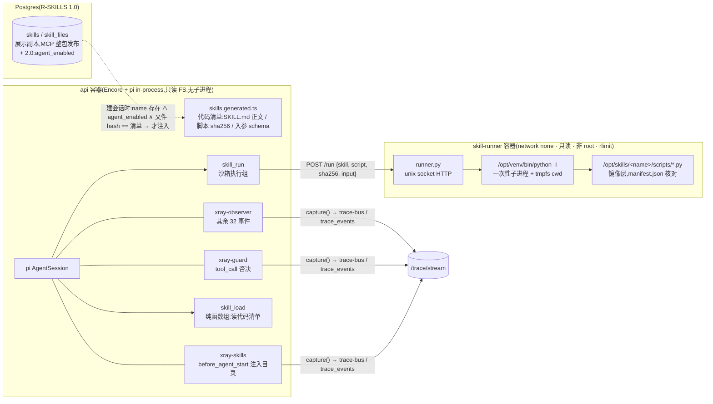

# 研究:让站点 agent 使用 Skills(注入 + 沙箱运行 Python 脚本)—— R-SKILLS 的 2.0 迭代

> 状态:**研究完成,所有者七条裁定已落(2026-09-03),已转为任务卡 [`round-skills-2.md`](round-skills-2.md)**。本文是依据与取舍,任务卡是交付清单。
> 前置:[R-SKILLS(1.0)](round-skills.md)—— Skills 技能库 tab,skills 经 MCP 整包入库、只展示不执行、agent 不可读。**2.0 建在它之上**,不另起一套 skill 存储。
> 依据:`docs/security.md` / `docs/architecture.md` / `apps/api/agent/*` 现状、`@earendil-works/pi-coding-agent@0.84.3` 源码实测(附 A)、
> 设计稿 1a–1g 与 2f–2h、`deploy/` 现状、所有者给的参考实现 `~/.pi/agent/extensions/python-workdir-guard.ts`(附 B)。
>
> 所有者的原始要求(编号沿用):① 给 agent 运行 skills 的能力;② 运行 skill 内的 Python 脚本;③ 运行阶段有 pi 守卫插件;
> ④ 脚本必须在虚拟环境里运行;⑤ 只能是内置的 skill 与脚本文件,不允许临时写脚本运行;⑥ 守卫轨迹、skill 注入轨迹、Python 运行轨迹在 Runtime 右栏可见。

## 0. 结论与七条裁定

**可行,但不能按字面做。**「pi 守卫插件 + 虚拟环境」是策略层,不是隔离边界;规则 9 与 `docs/security.md` §1 第 1 层写死了
「任意代码执行类工具永久禁止进 in-process 进程,确需时必须独立沙箱容器」,这一条守卫插件替代不了。所有者裁定(2026-09-03):

| # | 裁定项 | 裁定 |
|---|---|---|
| 1 | 做不做 | **做**。作为 `round-skills` 的 **2.0 迭代**(R-SKILLS-2),前置是 R-SKILLS(1.0)落地并合并 `main` |
| 2 | 规则 9 措辞 | **按默认**:「一次性沙箱容器」改为「独立沙箱容器(可常驻)+ 每次运行一次性的进程与工作目录」,残余风险(常驻容器共享内核)认下 |
| 3 | `skill_run` 归组 | **按默认**:单独第四组「沙箱执行组」;**先改画板 1f/1g**(所有者在画布上加第四组,沿用既有语义色),再进轮次 |
| 4 | 隔离强度 | **按默认**:执行容器 `network_mode: none`,api 经 unix socket 调它;spike 若证明 Encore 的 bun 运行时里 socket 不通,停下重估,不自行退到共网 |
| 5 | 首批 skills | **由所有者在 R-SKILLS(1.0)里经 MCP 上传**;**默认只展示、不注入**,agent 可用是逐 skill 显式打开 |
| 6 | 改 SKILL.md 要不要发版 | **要发版**:agent 可用的 skill(SKILL.md + 脚本 + 入参 schema)集合**在代码里**,随 runner 镜像与 api 生成清单发版;库里只能在这个集合之内打开 / 关闭;库内展示副本必须与代码副本逐字节一致才注入 |
| 7 | 130 预发 | **非必经**;隔离形态(出不去 / 只读 / 拒非清单脚本)在**生产冒烟**验收;验收通过前 `skill_run` 保持双闸关闭 |

推荐形态一句话:skills 内容经 1.0 入库展示;**可被 agent 使用的子集在代码里**(`runner/skills/`),构建期生成两端同源清单;
两个新工具 `skill_load`(纯函数组)/ `skill_run`(沙箱执行组,首个 `dangerous=TRUE`);一个 `network_mode: none` 的常驻执行容器经 unix socket 被 api 调用;
pi 侧 `xray-guard` / `xray-skills` 两个扩展把裁决写进既有 34 事件;前端零样式改动、两处投影逻辑改动。

## 1. 逐条对照:要求 × 现有约束 × 判定

| # | 要求 | 现状(实测/文档) | 判定 |
|---|---|---|---|
| ① | 运行 skills | pi 有 skills 机制(`SKILL.md` 发现 + `<available_skills>` 进系统提示词),**但依赖内置 `read` 工具**:`system-prompt.js` 只在 `read` 可用时才拼 skills 段,`formatSkillsForPrompt` 的第二行就是「Use the read tool to load a skill's file」。本站 `noTools:'all'` 且 `systemPromptOverride` 整体替换系统提示词 → pi 原生机制在本站是死的。R-SKILLS(1.0)又裁定 agent 不可读 `skills` 三表 | 可行,**自己做注入**:目录进系统提示词由我们拼,正文经只读工具 `skill_load` 取(附 A-1);数据来源是**代码清单**而不是库(裁定 6),所以 1.0「新表不授权 agent 角色」的口径不变 |
| ② | 运行 skill 内 Python 脚本 | 规则 9:「任意代码执行类工具永久禁止进 in-process 进程。未来确需执行类能力时,必须独立一次性沙箱容器」;§1 第 1 层表:文件系统 / 子进程对每一组都禁止;第 3 层:api 容器只读根 FS、不挂 docker.sock;1.0:`.py` 永不执行 | 可行,**只能在独立容器里**。api 不挂 docker.sock → 造不出「每次一个容器」→ 常驻执行容器 + 每次一次性进程(裁定 2)。1.0 的「永不执行」说的是 api / web 进程,与「在独立容器里执行」不冲突,但措辞要补一句(§3) |
| ③ | 运行守卫 pi 插件 | pi 的 `tool_call` 是 veto 点。实测:runner 按注册顺序遍历,**首个 block 即短路返回**;agent loop 把它造成 `isError:true` 的错误结果、给模型的正文就是 `reason`;**不触发 `tool_result` 链事件**,但 `tool_execution_start / end` 照常(附 A-2) | 可行。参考实现的核心形状(`pi.on("tool_call") → {block, reason}`)原样可用;它判的是 bash 命令串的正则,本站没有 bash → 守卫改判**结构化入参**(附 B) |
| ④ | 必须虚拟环境 | 参考实现靠正则识别 `.venv/bin/python` 与 `pip install`;威胁模型 5 的原话「兜底不在检测,而在能力……字符串仗打不赢」 | **由结构保证**:解释器路径是执行容器里的常量,工具没有 interpreter / 命令行字段;venv 在镜像构建期建好、依赖 `--require-hashes` 锁定;`-I` 隔离模式屏蔽 `PYTHON*` 变量与用户 site。守卫再核一遍清单是第二道,不是第一道 |
| ⑤ | 只能内置 skill / 脚本,不许临时写脚本 | R-TITLE 的做法:「会话 id 不做入参 → 改别人标题这句话在词汇表里不存在」 | 同一思路:`skill_run` 的入参**只有** `skill` / `script` / `input`,**没有** code / path / interpreter / argv;脚本在镜像层、根 FS 只读、sha256 三方核对(api 清单 / runner 清单 / 库内展示副本)。「临时写脚本」在接口上表达不出来 |
| ⑥ | 三条轨迹右栏可见 | 34 事件已含 `tool_call`(veto)/ `before_agent_start`(chain)/ `tool_execution_*`;画板 1a 有 `tool_call · bash` + `blocked` 徽标 + 「└ permission-gate returned {block: true}」;1b 有「EXTENSION RETURNED · context-injector」+ DIFF;1c 链式视图有多扩展步骤。前端目前把扩展名与返回值写死成 `xray-observer / undefined` | 可行,**不新增事件类型、不改样式**:后端给这两个事件加派生字段 `handlers`;前端 `trace-view.ts` 按它置徽标 / 注记 / 详情卡 / 链式步骤,`TimelineView.tsx` 那行写死的 `permission-gate` 改为绑定扩展名(§2.6) |

## 2. 方案(建在 R-SKILLS 1.0 之上)

### 2.1 总览



规则 9 的三句话各有落点:**api 进程仍然不 spawn 任何东西**(它只发一个 HTTP 请求);**执行发生在独立容器**;守卫与观测者只是 pi 扩展,不承担隔离。

### 2.2 哪些 skill 能被 agent 使用(要求 ①⑤;裁定 5、6)

**一个 skill 对 agent 可用,四个条件同时成立**(缺一即「只展示」,与 1.0 的默认一致):

1. **在代码里**:`runner/skills/<name>/` 存在(裁定 6)。构建期生成 `apps/api/agent/skills.generated.ts`(生成物、入库、不许手改,与 `api-client.ts` 同口径)与 `runner/manifest.json`,两端同源;
2. **库里已发布且打开**:1.0 的 `skills` 表里有同名行,且 2.0 新增列 `agent_enabled = TRUE`(MCP `skills_agent_set`,默认 FALSE);
3. **展示副本与代码副本一致**:库内 `skill_files` 的每个文件 sha256 与清单逐一相等(集合相等,多一个少一个都算漂移)。漂移 → 不注入、记日志、`skills_agent_status` 报 `drift` —— **访客在 Skills 页看到的,就是 agent 用的**;
4. **工具闸开着**:`tool_config` 的 `skill_load` 打开(注入型至少要它);可运行型另需 `skill_run` 打开 + 服务器 env `XRAY_UNLOCK_DANGEROUS_TOOLS=1`(R7 双闸,首次真正用上)。

**两个档次**(由 `runner/skills/<name>/xray.json` 有没有决定):

| 档次 | 内容 | 工具 | 例 |
|---|---|---|---|
| **注入型** | 只有 `SKILL.md`(可有 `references/` 但 v1 不读) | `skill_load` 把正文送进上下文,agent 照着做 | `encore-api` / `encore-database` / `encore-testing`(纯说明,无脚本) |
| **可运行型** | 另有 `xray.json` 声明可跑的脚本与各自入参 schema | `skill_load` + `skill_run` | 新写的 `text-tools`(词频 / JSON 格式化,纯标准库) |

**准入清单(可运行型)**,收录进 `runner/skills/` 前逐条过,一条不过就只做注入型或只展示:

- 脚本从 **stdin 读一个 JSON 对象**、结果写 stdout(≤ 64 KB);不读 argv、不读环境变量、不读 stdin 之外的输入;
- 只用标准库或 `runner/requirements.txt` 里钉住的依赖(新增依赖 = 发版);
- 不 `import subprocess` / `os.system` / `socket` / `ctypes`,不 `eval` / `exec` 动态代码,不写 cwd 之外的路径(容器层面本来也做不到,这一条是审阅口径);
- 确定性、单次 < 超时(默认 30 s)、不 fork;
- **egress 档例外**(R-WEBFETCH,所有者裁定 2026-09-03):`xray.json` 声明 `network: egress` 的 skill 允许 `socket` / `ssl` / `http.client`
  (仍禁 `subprocess` / `ctypes` / `eval`),「确定性」不要求;代价是审阅多一道 —— codex 审查按 `docs/security.md` §1 R-WEBFETCH 补记的
  七点 SSRF 判据逐条判,且这类 skill 只会被路由到只出公网的 `skill-runner-egress` 实例;
- `xray.json` 为每个脚本给 `description` 与入参 schema(`ToolParametersSchema` 同一子集:string / integer / boolean、required、长度上界);
- SKILL.md 自包含(不依赖 `references/`,没有 `read` 工具读不到);写给 Claude Code 的调用方式(`python scripts/x.py --flag`)照留,**本站的调用方式由 `skill_load` 按 `xray.json` 自动追加**一段「在本站:`skill_run(skill, script, input)`」,不要求所有者改写 SKILL.md。

**对画板 2f 那九个示例的判定**(所有者上传时按此归档,不是硬性清单):

| skill | 出处 | 判定 | 理由 |
|---|---|---|---|
| `encore-api` / `encore-database` / `encore-testing` | encoredev/skills | **注入型候选** | 单文件 SKILL.md,纯知识;注入后 agent 回答 Encore 问题有据可依 |
| `security-review` | anthropics/skills | 注入型候选 | 审查清单类,无脚本依赖 |
| `worktree-round` / `release-ship` / `notes-publish` | 自研 | **只展示** | 要 git / docker / MCP 客户端,沙箱里没有网络与这些工具 |
| `codex-review-loop` | 自研 | **只展示** | `scripts/review.py` 调 codex CLI,沙箱里不存在 |
| `pdf` | anthropics/skills | 只展示 | 要输入文件与 pypdf 等重依赖,访客无上传通路 |
| `text-tools`(新写) | 自研 | **可运行型** | 为本站契约写的演示 skill;另配一条「故意调不在清单里的脚本」的演示路径,对应画板 1a 的拦截演示芯片 |

### 2.3 两个工具(要求 ①②⑤)

| | `skill_load` | `skill_run` |
|---|---|---|
| 分组 | 纯函数组(`TOOL_REGISTRY`,但**不碰库**:读代码清单) | **第四组「沙箱执行组」**(新注册路径 `makeSkillRunTool(cfg)`) |
| 入参 | `name`(string ≤ 64) | `skill`(≤ 64)· `script`(≤ 64)· `input`(≤ 4096,JSON 对象文本) |
| 校验 | name ∈ 本会话可用集合 | skill ∈ 集合 ∧ script ∈ 其 `xray.json` ∧ `input` 解析为对象 ∧ 过 schema ∧ 无 NUL / 控制字符。**工具体与守卫各校一遍**(与外呼组「写入时一次、调用前一次」同一取舍) |
| 输出 | SKILL.md 正文 + 自动追加的「在本站的调用方式」(`capText`) | `exit=<n> · <耗时>` 一行 + stdout(`capText`,正文预算 8000)+ stderr 尾部 ≤ 1000;非零退出 / 超时 / 排队超时以 `ToolRefusal` 写死文案抛出(`isError:true`),不带容器内路径 |
| 限额 | 无 | `daily_quota.skill_runs`,上限 `sandbox_config.daily_run_limit`(0 = 不限);会话内次数由守卫计 |
| 进度 | 无 | `phases`: 校验 → 排队 → 运行中(每 5 s「运行中 Ns」)→ 已结束 |
| `tool_config` 种子 | `enabled=FALSE, dangerous=FALSE` | `enabled=FALSE, dangerous=TRUE`(`deploy/.env.example` 第 92–99 行「目前无用武之地」那段从此有用) |
| 前端 | Tools 面板自动出现 | 同左;第四组要改 `ToolsPanel.tsx` 的 `Record<ToolGroup,…>`(编译强制) |

**为什么 `input` 是一个 JSON 文本而不是 argv 数组**:`ToolParametersSchema` 目前只认 string / integer,数组要扩类型 + 扩面板;argv 是解析面(引号 / 空格 / `--`),stdin JSON 没有歧义;脚本从 stdin 读 JSON 最容易写对也最容易审。

### 2.4 执行容器 `skill-runner`(要求 ②④⑤;裁定 2、4)

| 项 | 取值 | 挡的是什么 |
|---|---|---|
| `network_mode: none` | 没有任何网络 | 脚本出网 / 访问 postgres / **回打 api:4000**(与 api 共用 internal 网络时,脚本能 `POST /agent/sessions` 灌库、对 `/mcp` 猜 token —— 共网方案的硬伤) |
| api ↔ runner 通道 | **unix socket**(命名卷 `runner_sock` 挂到两边 `/run/runner`,0660、两容器同 uid 10001) | 上一行的前提。Bun `fetch` 有 `unix` 选项,**要在 Encore 的 bun 运行时里实测**(spike;备选 `node:http` 的 `socketPath`);不通则停下回所有者(裁定 4) |
| `read_only: true` + `tmpfs /run/work:rw,noexec,nosuid,nodev,size=64m` | 每次运行一个 `/run/work/<uuid>`,结束即删 | 脚本落盘 / 互相留东西 / 丢二进制再执行 |
| `user: 10001`、`cap_drop: [ALL]`、`no-new-privileges` | 同 api | 同 api |
| `mem_limit 384m` · `pids_limit 64` · `cpus: 1.0` | 容器级 | OOM / fork 炸弹 / 抢 CPU |
| 子进程 rlimit(`preexec_fn`) | `AS 256M` · `CPU` = 超时秒数 · `NPROC 16` · `FSIZE 16M` · `NOFILE 64` · `CORE 0` | 单次运行级兜底,与容器级是两道 |
| 解释器 | `/opt/venv/bin/python -I -B <script>`,`env` 只有 `PATH=/opt/venv/bin`、`HOME=<cwd>`、`LANG`;stdin = input JSON 后关闭;`start_new_session=True`,超时 kill 进程组 | 要求 ④:venv 是常量;`-I` 忽略 `PYTHON*`、不加脚本目录进 sys.path、无用户 site |
| 脚本定位 | `realpath(/opt/skills/<skill>/scripts/<script>)` 在目录内 ∧ 普通文件 ∧ sha256 == api 传来的 == `manifest.json` | 要求 ⑤ |
| 并发 | 信号量 2;排队计入总超时 | 8 个会话同时跑脚本时不把 1 vCPU 打满 |
| 输出 | stdout / stderr 各按字节流式截断(256 KiB),回 `{exitCode, timedOut, durationMs, stdout, stderr, truncated}` | 几百 MB 输出吃光内存 |
| 健康 | `GET /health` 走同一 socket;compose `healthcheck` | 生产冒烟 |

**它不是「一次性容器」**(裁定 2 已认):同一容器、同一内核命名空间为所有运行服务。得到 read-only + 无网络 + 每次独立进程与目录 + rlimit;
失去「两次运行之间的内核级隔离」。为什么接受:「每次一个容器」要么给 api 挂 docker.sock(等于 root,与第 3 层直接冲突),要么上 gVisor / Firecracker(2 vCPU 轻量服务器不现实)。
升级路径:runner 换 gVisor runtime(`runtime: runsc`,compose 一行),协议不变。

### 2.5 pi 侧两个扩展(要求 ③⑥)

两者都是 `runtime.ts` 里与 `makeObserver` 同款的 InlineExtension,拿着 `rec` 闭包,**永远注册**(不随 skills 开关),注册顺序 `[xray-skills, xray-observer, xray-guard]`。

**`xray-guard`(守卫)** —— 只订阅 `tool_call`,规则按序判、首条命中即 `{block:true, reason}`:

1. `toolName` ∉ 本会话白名单 → 拦(pi 自己也会拒,这是第二道);
2. `skill_load` / `skill_run` 的 skill 不在本会话可用集合 → 拦,`reason` 说「该 skill 未对 agent 开放」;
3. `skill_run`:script 不在 `xray.json` / `input` 不是 JSON 对象 / 不过 schema / 超长 / 含控制字符 → 拦,`reason` 写清哪一项(给模型改正用);
4. 会话内计数:每 turn ≤ 3 次、每会话 ≤ 12 次(代码常量;`turn_start` 归零)→ 拦,文案带「不必重试」;
5. **守卫自身抛异常 = 拦截,不是放行**(try/catch 兜底为固定 reason;pi 对 handler 异常的处理会把栈信息外泄进错误文案,所以自己兜)。

它**不**做参考实现里的这些(附 B):不建 venv、不读 `process.env`、不 `registerCommand`(访客输入以 `/` 开头会被 pi 当命令分发,附 A-4)、不 `ctx.ui.notify`。

**`xray-skills`(注入器)** —— 只订阅 `before_agent_start`:返回 `{systemPrompt: event.systemPrompt + <available_skills 目录>}`(只列本会话可用集合的 name + description + 档次)。
pi 对多个扩展的 `systemPrompt` 是链式叠加、下一轮无人返回就回到 base(附 A-3),每轮注入、幂等。
不直接写进 `systemPromptFor` 的理由:那样注入这件事在轨迹里不存在;放在 chain 事件里,每一轮的 `before_agent_start` 行都能展开看到「xray-skills 返回了什么」—— 画板 1b 那张 `context-injector` 卡。

**「谁裁决,谁记录」**:观测者不再订阅这两个事件,改由守卫 / 注入器在自己的 handler 里调同一个 `capture(rec, name, event, handlers)`。
原因是实测的短路语义(附 A-2):守卫一旦 `block`,排在它后面的 handler 看不到事件;把观测者排在前面,它又看不到裁决结果。
让裁决者自己落笔,`tool_call` 这一行的数据里就带着 `handlers: [{extension:"xray-guard", returned:{block:true, reason}}]`。

### 2.6 轨迹与右栏可见性(要求 ⑥),逐事件

后端(`events.ts`):`tool_call` 与 `before_agent_start` 的白名单各加派生字段 `handlers`(`[{extension, returned}]`,`returned` 是摘要:`{block, reason≤200}` / `{systemPromptDelta:+N, skills:[…]}`,不放原文)。
前端(`trace-view.ts` 投影 + `TimelineView.tsx` 一行文案绑定),**零样式改动**:

| 轨迹 | Timeline 行(既有事件) | 详情卡 / 徽标(画板 1a/1b 已有) | 需要改的地方 |
|---|---|---|---|
| **守卫放行** | `tool_call · skill_run`(红,veto) | 详情卡 EXTENSION RETURNED · **xray-guard** / `undefined` | `toRow` 从 `data.handlers` 取扩展名与返回值,不再写死 `xray-observer` |
| **守卫拦截** | `tool_execution_start · skill_run` → `tool_call · skill_run` **[blocked]** → `tool_execution_end · skill_run`(`isError:true`,`resultPreview` = reason) | 行尾红色 `blocked` 徽标 + 「└ xray-guard returned {block: true}」注记(画板 1a 第 1043 行);对话区 ToolChip 显示为错误 | `hasBadge/hasNote = handlers.some(h => h.returned?.block)`;`TimelineView.tsx:112–116` 写死的 `permission-gate` 改成 `{extension}` |
| **skill 目录注入** | `before_agent_start`(蓝,chain) | 详情卡 EXTENSION RETURNED · **xray-skills** / `{ systemPromptDelta: +812, skills: ["encore-api", "text-tools"] }`;Chain View 步骤列表 = `handlers` | `toChainView` 的 `steps` 从 `handlers` 生成,没有时保留今天的观测者只读文案 |
| **skill 正文加载** | `tool_call · skill_load` → `tool_execution_start/end · skill_load` → `tool_result · skill_load` | 与现有工具一样;`resultPreview` 是正文前 200 字 | 无 |
| **Python 运行** | `tool_call · skill_run` → `tool_execution_start · skill_run` → `tool_execution_update ×k`(校验 / 排队 / 运行中 3s / 已结束 exit=0)→ `tool_execution_end` → `tool_result` | 与 `web_search` / `generate_image` 完全同构 | 无 |

一处事实,免得实测时误判:pi 是**先发 `tool_execution_start` 再问 `tool_call`**(附 A-2),被拦截的调用在 Timeline 上是「start → call[blocked] → end(isError)」,与画板 1a 示例的「call → start」顺序不同。这是现状,不是本轮引入的。

### 2.7 配置面与限额(MCP)

- 迁移 013(纯追加,依赖 1.0 的 012):`skills.agent_enabled BOOLEAN NOT NULL DEFAULT FALSE`;`sandbox_config` 单行表(`daily_run_limit` 0 = 不限;`total_timeout_ms` 默认 30000,CHECK 5000–120000);`daily_quota.skill_runs`;`tool_config` 两行种子(§2.3)。`agent_ro` 对新表新列无权限(不写 GRANT 就是答案,1.0 口径不变)。
- MCP 工具 +4(1.0 的 42 → 46):`skills_agent_set(name, enabled)` · `skills_agent_status`(代码清单里每个 skill:库里有没有 / 打开没有 / hash 一致还是 `drift`)· `sandbox_config_get` / `sandbox_config_set`。
- 打开顺序:发版(runner 镜像 + api)→ 生产冒烟四条(§2.8)→ `tool_config_set skill_load true` → `skills_agent_set <name> true` → 服务器 `.env` 加 `XRAY_UNLOCK_DANGEROUS_TOOLS=1` 并**重建 api** → `tool_config_set skill_run true`。可用集合的指纹并进 `EnabledTools.fingerprint`,任一变化下一轮重建会话(R6/R7 规则)。
- 止损:`tool_config_set skill_run false` 当场停用;`skills_agent_set <name> false` 单个下线;`docker compose stop skill-runner` 则工具调用全部以固定文案失败,站点其余照常。

### 2.8 部署、本机开发与生产冒烟(裁定 7)

- `dev.ps1 build` 出第三个镜像 `xray-runner:<sha>`(`docker build runner/`);`ship` 三镜像一起 save;compose 加服务 + 命名卷。规则 11 不受影响:runner 不是 JS 运行时,基座 `python:3.12-slim` 按 digest 钉(境内先 `docker pull`)。
- 主机预算:3.6 GiB 下现有 128 + 384 + 1024 + 768 = 2304 MB,加 384 MB 后剩 ~900 MB 给 OS 与 cache;`docs/deploy-cn-lightweight.md` §0 预算表加一行。
- **本机开发拿不到 unix socket**(api 在 Windows 宿主,runner 在容器里):runner 有 `RUNNER_LISTEN=tcp://0.0.0.0:8000` 开发模式,`dev.ps1 runner` 起 `docker run --rm -p 127.0.0.1:8000:8000`;api 侧 `XRAY_SKILL_RUNNER_URL` 只在注册环节读,且只接受 `unix:` 默认值或 `http://127.0.0.1:<port>`(代码级闭集)。
- **生产冒烟 +4 条**(`docs/deploy-environments.md` 冒烟清单第 6 步追加;`skill_run` 双闸关闭状态下跑):① `skill-runner` healthy;② 容器内 `python -c "import socket; socket.create_connection(('1.1.1.1',53),2)"` 失败、`ip route` 为空;③ 容器内 `touch /opt/skills/x` 失败(只读);④ 经 socket 对 `/run` 发一个不在清单里的脚本名 → 拒绝。四条过了才走 §2.7 的打开顺序。
- `dev.ps1 test`:守卫规则 / 清单生成 / schema 校验 / hash 一致性 / 指纹 / 限额是纯逻辑测试;runner 协议用假 HTTP 服务;真跑脚本只在生产冒烟。

## 3. 与现有规范的冲突清单(本次文档轮已改)

| 文件 | 改动 | 依据 |
|---|---|---|
| `docs/security.md` §1 第 1 层 | 「必须独立**一次性**沙箱容器」→「必须独立沙箱容器,不共享本进程;容器可常驻,每次运行必须是一次性的进程与工作目录」;加第四组「沙箱执行组」与八条附加约束(R-SKILLS-2 补记) | 规则 9;裁定 2、3 |
| `docs/security.md` §0 | 威胁模型第 6 条「代码执行」 | 同上 |
| `docs/security.md` 第 3 层 / 第 4 层 / §7 | runner 容器的隔离参数;`daily_quota.skill_runs`;requirements hash 锁定、基座 digest、内置脚本审阅清单 | 同上 |
| `docs/security.md` §1 第 2 层 R-SKILLS 补记 | 补一句:2.0 的注入来源是代码清单,库只提供「打开 / 关闭 + 一致性判据」,agent 角色对 skills 三表仍无权限 | 裁定 6 |
| `CLAUDE.md` 规则 8 | 2026-09-03 修订(R-SKILLS-2):agent 使用 skills 是产品能力扩面,所有者裁定做;第四组先改画板 1f/1g | 规则 8;裁定 1、3 |
| `CLAUDE.md` 规则 9 | 红线速记加「执行类能力只在独立沙箱容器」;「工具分三组」→「四组」 | 规则 9 |
| `CLAUDE.md` 仓库结构 / `docs/architecture.md` / `README.md` | `runner/` 目录、`skill-runner` 容器与 unix socket 决策(待实现) | — |
| `design/…Workbench.dc.html` 1f/1g | 加第四组「沙箱执行」(建议沿用 `#8b5cf6`)+ 示例工具 `skill_run` —— **所有者在画布上改,是 2.0 开工前置** | R-TOOLS 先例 |

**不用改的**:画板 1a/1b/1c(拦截徽标、注记、EXTENSION RETURNED 卡、链式步骤都已画着);1.0 的三张表结构与八个 MCP 工具;第 1 层「执行类工具双闸」那条(它就是为这件事准备的)。

## 4. 安全分析

访客(经模型)能控制的输入面:`skill` / `script`(两个闭集里挑)、`input`(≤ 4 KiB 的 JSON,过 schema)。控不到:解释器、命令行、代码、路径、网络、环境变量、并发数、超时。

| 威胁 | 落点 |
|---|---|
| 临时写脚本 / 改脚本 | 接口无此字段;镜像层只读;sha256 三方核对(api 清单 / runner 清单 / 库内展示副本) |
| 经 MCP 改库里的脚本让 agent 跑别的东西 | 库不是执行来源;库改了 = 与代码漂移 = 不注入(§2.2 第 3 条)。管理 token 泄漏的后果仍是「能开关」,不是「能执行任意代码」—— 与「白名单在代码里、库里只能在白名单之内挑」同一原则 |
| 借脚本出网(SSRF / 代理 / 外泄) | `network_mode: none`,连 DNS 都没有 |
| 借脚本触达 api / postgres | 不在任何 docker 网络;api 只能经 socket 主动找它,反向无通道 |
| 资源耗尽 | 容器 mem/pids/cpus + 子进程 rlimit + 总超时 + 并发 2 + 日限额 + 会话内次数 |
| 输出撑爆上下文 / 事件流 | runner 256 KiB → api `capText` 8000 → 事件 `previewText` |
| 脚本输出里的指令注入 | 威胁模型 5 同款:不做指令过滤,靠「被注入也调不动别的东西」;系统提示词写明「输出是数据」 |
| 注入型 SKILL.md 本身带指令 | 与 notes 正文同一信任级(所有者发布的内容);且只有代码里的 skill 才能注入,库改不了它 |
| 守卫被绕过 | 守卫是第二道;第一道是工具体校验 + runner 自校验;三处任一拒绝即失败 |
| 内置脚本本身有洞 | 准入清单 + codex 审查(它在仓库里,走轮次审查)+ 容器里只有只读 FS 与 tmpfs |
| 内核逃逸 | **残余风险**(裁定 2 已认):常驻容器共享内核。缓解:默认 seccomp、`cap_drop ALL`、非 root、`no-new-privileges`;升级路径 gVisor |
| 供应链 | 依赖 hash 锁定、基座 digest;pi 侧零新增 npm 依赖(runner 用 stdlib) |

## 5. 不推荐的替代方案

| 方案 | 为什么不 |
|---|---|
| in-process 执行 + 守卫插件(按字面理解要求 ③④) | 违反规则 9;守卫是清单校验不是隔离;一个 `bytearray(10**9)` 就把 api 的 1g 打没,全站一起死 |
| api 挂 docker.sock,每次运行起一个容器 | docker.sock ≈ root;与第 3 层「不挂 docker.sock」冲突,上线检查单专门扫它 |
| runner 与 api 共用 internal 网络(TCP) | 脚本能回打 api:4000(§2.4 第一行) |
| 从库里把脚本推给 runner 执行(不发版) | 管理 token 泄漏就升级成任意代码执行;脚本绕开 codex 审查;与裁定 6 相反。**备选记 BACKLOG**:注入型(纯文本)skill 直接从库注入,与 `notes_get_chapter` 同一信任级 —— 要重裁裁定 6 |
| pyodide / WASM 在 api 进程里跑 | 仍是「代码执行进 in-process」,CPU / 内存在同一进程 |
| 用 pi 原生 skills 机制(`additionalSkillPaths` + `read`) | 要开 `read`,规则 9 禁止;`/skill:name` 会把正文整段塞进用户消息(附 A-4),访客可触发 |
| 直接照搬 `python-workdir-guard.ts` | 它守的是「一个有 bash 的本机工作区」;本站没有 bash、没有 cwd、根 FS 只读;能留下的只有 `tool_call → {block, reason}` 这个形状(附 B) |

## 6. 依赖关系与顺序

```
R-SKILLS 1.0(代码:三张表 / 八个 MCP 工具 / skills 服务 / 第四 tab)──┐
画板 1f/1g 加第四组(所有者画布)────────────────────────────────────┼──▶ R-SKILLS-2 开工
spike:Encore bun 运行时 fetch 走 unix socket(可与 1.0 并行做)──────┘         │
                                                                              ▼
                                            发版(双闸关闭)→ 生产冒烟 4 条 → 逐 skill 打开
```

- 2.0 的迁移 013 依赖 012;`skills_agent_set` 依赖 1.0 的 `skills` 表;hash 一致性判据依赖 1.0 的 `skill_files`。
- spike 不过 → 不进 2.0,回所有者重裁裁定 4(裁定原文:不自行退到共网)。
- 本文档轮(规则 9 先改文档)已合并 `main`;2.0 代码轮另开 session,从 [`round-skills-2.md`](round-skills-2.md) 开工。

## 7. 代价与工作量(估)

- 新增面:1 个容器(+384 MB 预算)、1 条迁移、2 个工具、2 个 pi 扩展、4 个 MCP 工具、1 个构建期生成器、`dev.ps1` 3 个子命令、前端 3 处逻辑。
- 量级:大于 R-IMAGEGEN(它没有新容器、没有构建期生成物),小于 R9。
- 长期维护热点:可运行脚本的审阅、`dev.ps1 build` 的第三个镜像(与 `$hostedServices` 同类「漏补」热点)、清单生成物的漂移测试、库内副本与代码副本的一致性(`skills_agent_status` 是给所有者看的那面镜子)。

---

## 附 A:pi 0.84.3 内核实测依据(源码位置,主 checkout 的 `apps/api/node_modules/@earendil-works/pi-coding-agent`)

- **A-1 skills 依赖 `read`**:`dist/core/system-prompt.js:27–30, 112–114` —— 只有 `read` 在 selectedTools 里才 `formatSkillsForPrompt`;`dist/core/skills.js:275–296` —— 提示词原文「Use the read tool to load a skill's file」。`resource-loader.d.ts` 提供 `noSkills` / `additionalSkillPaths` / `skillsOverride`;本站 loader 应显式 `noSkills: true`。
- **A-2 `tool_call` 否决的完整路径**:`dist/core/extensions/runner.js:701–719` `emitToolCall` —— 按注册顺序遍历,`result.block` 为真**立即 return**;`dist/core/agent-session.js:214–241` `_installAgentToolHooks` —— `beforeToolCall` 直连它,handler 抛异常时整段变成「Extension failed, blocking execution」;`pi-agent-core/dist/agent-loop.js`(嵌套在 pi-coding-agent 自己的 node_modules 里)`executeToolCallsSequential` —— **先** `emit tool_execution_start`,再 `prepareToolCall`;`prepareToolCall` —— 参数先过 `validateToolArguments`,再问 `beforeToolCall`;`block` → `createErrorToolResult(reason)`,`kind:"immediate"`,`isError:true`;immediate 结果不经过 `finalizeExecutedToolCall`,因此 `afterToolCall`(扩展的 `tool_result` 事件)**不触发**;`emitToolExecutionEnd` 与 toolResult 消息的 `message_start/end` 照常。
- **A-3 `before_agent_start` 链式语义**:`runner.js:837–870` —— 每个 handler 收到的 `event.systemPrompt` 是前一个 handler 修改后的值;`agent-session.js:887–907` —— 有人返回 `systemPrompt` 就覆盖本轮,否则回到 base。`sendCustomMessage`(`:1071–1100`)非流式路径会发 `message_start/end`,本站的历史注入走这条。
- **A-4 访客输入以 `/` 开头会走命令分发**:`agent-session.js:795–831` `prompt()` 默认 `expandPromptTemplates: true`,`text.startsWith("/")` 先试扩展命令、再试 `/skill:` 与 prompt template。今天没有任何命令与 skill 被加载所以无害;**守卫与注入器都不得 `registerCommand`**,loader 保持 `noSkills`。
- **A-5 类型面**:`extensions/types.d.ts:699–702` `CustomToolCallEvent.input` 可就地改写(本方案不改写);`:803–812` `ToolCallEventResult {block, reason, terminate}`;`sdk.d.ts:33–47` `noTools / tools / customTools` 三参数即现有闸。

## 附 B:`python-workdir-guard.ts` 逐段迁移对照

| 参考实现的段落 | 在本站的命运 | 原因 |
|---|---|---|
| `session_start` / `before_agent_start` 里 `createVenvIfMissing` | **删** | api 根 FS 只读、`ISOLATED_DIR` 是空隔离目录;venv 在 runner 镜像构建期建好 |
| `tool_call` 对 `bash` 的命令串切分 + 正则 | **删** | 本站无 bash 工具;威胁模型 5 说的「字符串仗」。替换为对 `skill_run` 结构化入参的清单 + schema 校验 |
| `tool_call` 对 `write` / `edit` 的 Python 相关路径拦截 | **删** | 无 write / edit |
| `segmentUsesBundledPython` / `PI_PY_GUARD_BUNDLED_PYTHON` | **变成常量** | 解释器路径是 runner 里的常量 |
| `PI_PY_GUARD_*` 环境变量开关 | **删** | 工具体不读 `process.env`;策略是代码 + `tool_config` / `sandbox_config` / `skills.agent_enabled` |
| `ctx.ui.notify` / `pi.sendMessage(customType…)` | **删 / 换** | headless 无 UI;可见性改走轨迹事件的 `handlers` 字段 |
| `registerCommand("python-workdir-guard")` | **删** | 访客能触发(附 A-4) |
| `return { block: true, reason }` 的形状与「reason 写清怎么改」的文案风格 | **保留** | pi 的 veto 契约,也是模型能自我纠正的关键 |
| 「失败不缓存、下次重试」的 `ensurePromises` 思路 | **保留精神** | 守卫状态按 `rec` 存、`turn_start` 归零,不跨会话 |
