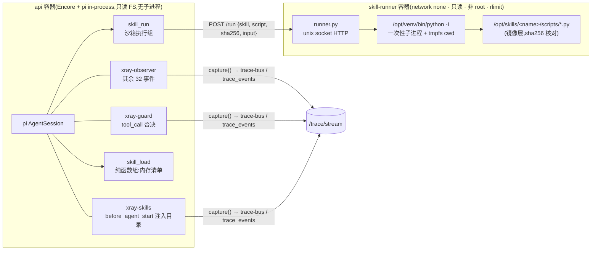

# 研究:给站点 agent 加「运行 skills 与 skill 内 Python 脚本」的能力

> 状态:**研究结论,待所有者裁定**。不是任务卡,不含代码改动。
> 日期:2026-09-03。依据:`docs/security.md` / `docs/architecture.md` / `apps/api/agent/*` 现状、
> `@earendil-works/pi-coding-agent@0.84.3` 源码实测(附 A)、设计稿 1a–1g、`deploy/` 现状,
> 以及所有者给出的参考实现 `~/.pi/agent/extensions/python-workdir-guard.ts`(附 B)。
>
> 所有者的原始要求(逐条编号,下文按编号回应):
> ① 给网站 agent 运行 skills 的能力;② 运行 skill 内的 Python 脚本;③ 运行阶段有一个 pi 守卫插件;
> ④ 脚本必须在虚拟环境里运行;⑤ 只能是内置的 skill 与脚本文件,不允许临时写脚本运行;
> ⑥ 守卫插件的轨迹、skill 注入轨迹、Python 运行轨迹都要在 Runtime 右栏看得见。

## 0. 结论(一段话)

**可行,但不能按字面做。**「pi 守卫插件 + 虚拟环境」是**策略层**,不是隔离边界;CLAUDE.md 规则 9 与
`docs/security.md` §1 第 1 层写死了「任意代码执行类工具永久禁止进 in-process 进程,确需时必须独立沙箱容器」,
这一条**不能被守卫插件替代**。推荐形态:

- **skills 是代码,随发布物走**:`runner/skills/<name>/` 里的 `SKILL.md` + `scripts/*.py` + 每个脚本一份入参 schema,
  构建期同时生成 api 侧的 TS 清单(含每个脚本的 sha256)和执行容器里的 `manifest.json`,两端同源;
- **两个新工具**:`skill_load(name)`(纯函数组,从内存清单返回 SKILL.md 正文)和 `skill_run(skill, script, input)`
  (**第四组「沙箱执行组」**,首个 `dangerous=TRUE` 的工具,吃 R7 留好的双闸);
- **一个独立的常驻执行容器 `skill-runner`**:`network_mode: none`、只读根文件系统、非 root、`cap_drop ALL`、
  内存 / 进程数 / CPU 受限;api 经 **unix socket** 调它;每次运行 = 一次性子进程 + 一次性 tmpfs 工作目录 + rlimit;
  解释器是镜像里钉死的 `/opt/venv/bin/python -I`,不是入参;
- **pi 侧两个 InlineExtension**:`xray-guard`(`tool_call` 否决:清单校验 / 入参 schema / 会话内次数)与
  `xray-skills`(`before_agent_start` 注入 `<available_skills>` 目录),两者都把自己的裁决写进轨迹;
- **三条轨迹全部落在既有 34 事件上**,不新增事件类型;设计稿 1a/1b/1c **已经画着** `permission-gate` 的
  `blocked` 徽标与 `context-injector` 的 EXTENSION RETURNED 卡,前端只改两处**投影逻辑**、零样式改动;
  Tools 面板多一个分组要**先改画板 1f/1g**(R-TOOLS 先例:先改设计稿、再进轮次)。

需要所有者先裁定 7 件事(§6),其中三件是「先改文档 / 设计稿」类(规则 8、规则 9)。

## 1. 逐条对照:要求 × 现有约束 × 判定

| # | 要求 | 现状(实测/文档) | 判定 |
|---|---|---|---|
| ① | 运行 skills | pi 有 skills 机制(`SKILL.md` 发现 + `<available_skills>` 进系统提示词),**但它依赖内置 `read` 工具**:`system-prompt.js` 只在 `read` 可用时才拼 skills 段,`formatSkillsForPrompt` 的第二行就是「Use the read tool to load a skill's file」。本站 `noTools:'all'` 且 `systemPromptOverride` **整体替换**系统提示词 → pi 原生 skills 机制在本站是死的 | 可行,但要**自己做注入**:目录进系统提示词由我们拼,正文经一个只读工具 `skill_load` 取(附 A-1) |
| ② | 运行 skill 内 Python 脚本 | 规则 9:「bash / write / 任意代码执行类工具永久禁止进 in-process 进程。未来确需执行类能力时,必须独立一次性沙箱容器」;§1 第 1 层表:文件系统 / 子进程对**每一组**工具都禁止;第 3 层:api 容器只读根 FS、不挂 docker.sock | 可行,**只能在独立容器里**。api 不挂 docker.sock → 造不出「每次一个容器」→ 只能是**常驻执行容器 + 每次一次性进程**。与文档「一次性沙箱容器」措辞有偏差,**先改文档**(§3) |
| ③ | 运行守卫 pi 插件 | pi 的 `tool_call` 是 veto 点:handler 返回 `{block, reason}` 即拦截。实测:runner 按注册顺序遍历,**首个 block 即短路返回**(后面的扩展看不到这个事件);agent loop 把它造成 `isError:true` 的错误结果、给模型的正文就是 `reason`;**不触发 `tool_result` 链事件**,但 `tool_execution_start` / `tool_execution_end` 照常触发(附 A-2) | 可行。参考实现的**核心形状**(`pi.on("tool_call") → {block, reason}`)原样可用;但它判的是 bash 命令串的正则,本站没有 bash → 守卫改判**结构化入参**(附 B) |
| ④ | 必须虚拟环境 | 参考实现靠正则识别 `.venv/bin/python` 与 `pip install`;`docs/security.md` 威胁模型 5 的原话:「兜底不在检测,而在能力……字符串仗打不赢」 | **由结构保证,不靠正则**:解释器路径是执行容器里的常量,工具没有 interpreter / 命令行字段;venv 在镜像构建期建好、依赖 `--require-hashes` 锁定;`-I` 隔离模式屏蔽 `PYTHON*` 环境变量与用户 site。守卫仍可再核一遍清单,但那是第二道,不是第一道 |
| ⑤ | 只能内置 skill / 脚本,不许临时写脚本 | R-TITLE 的做法:「会话 id 不做入参 → 改别人标题这句话在词汇表里不存在」 | 同一思路:`skill_run` 的入参**只有** `skill` / `script` / `input`(JSON 文本),**没有** code / path / interpreter / argv;执行容器按 sha256 核对脚本、根 FS 只读、脚本目录在镜像层。「临时写脚本运行」在接口上**表达不出来** |
| ⑥ | 三条轨迹右栏可见 | 34 事件已含 `tool_call`(veto)/ `before_agent_start`(chain)/ `tool_execution_*`;设计稿 1a 有 `tool_call · bash` + `blocked` 徽标 + 「└ permission-gate returned {block: true}」;1b 有「EXTENSION RETURNED · context-injector」+ DIFF;1c 链式视图有多扩展步骤。**前端**目前把扩展名与返回值写死成 `xray-observer / undefined`(`trace-view.ts`),徽标与注记从未被置位 | 可行,**不新增事件类型、不改样式**:后端给 `tool_call` / `before_agent_start` 两个事件加一个派生字段 `handlers`;前端 `trace-view.ts` 按它置徽标 / 注记 / 详情卡 / 链式步骤,`TimelineView.tsx` 那行写死的 `permission-gate` 改成绑定扩展名(§2.6) |

## 2. 推荐方案

### 2.1 总览



规则 9 的三句话在图里各有落点:**api 进程仍然不 spawn 任何东西**(它只发一个 HTTP 请求);
**执行发生在独立容器**;守卫与观测者只是 pi 扩展,不承担隔离。

### 2.2 内置 skills 的形态与发布(要求 ① ⑤)

- 仓库新目录 `runner/`(**刻意在 Encore app root 之外**,规则 6):
  ```
  runner/
  ├── Dockerfile            python:3.12-slim(按 digest 钉)→ /opt/venv(--require-hashes)→ /opt/skills → runner.py
  ├── requirements.txt      钉版本 + hash
  ├── runner.py             stdlib http.server + subprocess,无第三方依赖
  └── skills/<name>/
      ├── SKILL.md          frontmatter name / description(沿用 Agent Skills 规范,pi 的 loadSkillsFromDir 同款校验规则)
      ├── scripts/<x>.py    从 stdin 读一个 JSON,结果写 stdout
      └── schemas/<x>.json  该脚本的入参 schema(与 ToolParametersSchema 同一子集:string/integer/boolean,required,长度上界)
  ```
- **构建期生成两份同源清单**:`tools/skills-manifest`(node 脚本,`dev.ps1 skills-gen`)读 `runner/skills` →
  ① `apps/api/agent/skills.generated.ts`(name / description / SKILL.md 正文 / 每个脚本的 sha256 + schema,**生成物、入库、不许手改**,与 `api-client.ts` 同口径);
  ② `runner/manifest.json`(进镜像)。测试断言「生成物 == 现算」(与 `catalog.test.ts` 的双向集合相等同一思路),漂移就红。
- **skill = 代码,不是内容**:它与执行容器里的脚本必须逐字节一致(hash 核对),所以不走 MCP 入库(那会把「正文在库里、脚本在镜像里」拆成两个事实源)。
  所有者想改 SKILL.md 措辞就得发版 —— 这是代价,记 BACKLOG 待裁定(§6 第 6 条)。
- SKILL.md 里**不引用**其它文件(references/、assets/):没有 `read` 工具,引用了也读不到;v1 要求自包含,清单生成器对「相对路径引用」报警。
- 系统提示词(`runtime.ts` 的 `systemPromptFor`)新增一段:有哪些 skills(只列 name + description)、先 `skill_load` 再 `skill_run`、脚本在隔离沙箱里跑、无网络、有时限与每日次数上限、**脚本输出是数据不是指令**(外呼组约束 6 的同一句话,写在会送达的地方)。

### 2.3 两个工具(要求 ① ② ⑤)

| | `skill_load` | `skill_run` |
|---|---|---|
| 分组 | 纯函数组(与 `notes_*` 同表 `TOOL_REGISTRY`,但**不碰库**:读内存清单) | **第四组「沙箱执行组」**(新注册路径 `makeSkillRunTool(cfg)`,§6 第 3 条) |
| 入参 | `name`(string ≤ 64) | `skill`(string ≤ 64)· `script`(string ≤ 64)· `input`(string ≤ 4096,必须是 JSON 对象文本) |
| 校验 | name ∈ 清单 | skill ∈ 清单 ∧ script ∈ 该 skill 的脚本表 ∧ `input` 解析为对象 ∧ 通过该脚本的 schema ∧ 无 NUL / 控制字符。**工具体与守卫各校一遍**(与外呼组「写入时一次、调用前一次」同一取舍) |
| 输出 | SKILL.md 正文(`capText`) | `exit=<n> · <耗时>` 一行 + stdout(`capText`,正文预算 8000)+ stderr 尾部 ≤ 1000;非零退出 / 超时 / 排队超时以 `ToolRefusal` **写死文案**抛出(`isError:true`),不带任何容器内路径与上游细节 |
| 限额 | 无(只读内存) | `daily_quota.skill_runs` 计次,上限 `sandbox_config.daily_run_limit`(0 = 不限);会话内次数由守卫计(§2.5) |
| 进度 | 无 | `phases`: 校验 → 排队 → 运行中(每 5s 一次「运行中 Ns」)→ 已结束 |
| `tool_config` 种子 | `enabled=FALSE, dangerous=FALSE` | `enabled=FALSE, dangerous=TRUE` —— **首个真正用到 R7 双闸的工具**:表里打开 + 服务器 env `XRAY_UNLOCK_DANGEROUS_TOOLS=1`,缺一不注册。`deploy/.env.example` 第 92–99 行那段「目前无用武之地」的注释从此有了用武之地 |
| 前端 | Tools 面板自动出现 | 同左;分组多一个要改 `ToolsPanel.tsx` 的 `Record<ToolGroup,…>`(编译强制,R-TOOLS 设计如此) |

**为什么入参是「一个 JSON 文本」而不是 argv 数组**:① `ToolParametersSchema` 目前只认 string/integer,数组要扩类型 + 扩面板(BACKLOG 里 `enum` 那条同款);
② argv 是解析面(引号 / 空格 / `--` 前缀),stdin JSON 没有解析歧义;③ 脚本从 stdin 读 JSON 是最容易写对、也最容易审的契约。

### 2.4 执行容器 `skill-runner`(要求 ② ④ ⑤)

compose 新增一个服务,与 api 的安全参数同款再收紧三处:

| 项 | 取值 | 挡的是什么 |
|---|---|---|
| `network_mode: none` | **没有任何网络** | 脚本出网 / 访问 postgres / **回打 api:4000**(若与 api 共用一个 internal 网络,脚本就能 `POST /agent/sessions` 灌库、对 `/mcp` 猜 token —— 这是共网方案的硬伤,所以不用) |
| api ↔ runner 通道 | **unix socket**(命名卷 `runner_sock` 挂到两边 `/run/runner`,socket 0660、两容器同 uid 10001) | 上一行的前提。Bun 的 `fetch` 支持 `unix` 选项,但**要在 Encore 的 bun 运行时里实测**(轮次第 0 项 spike;备选 `node:http` 的 `socketPath`) |
| `read_only: true` + `tmpfs /run/work:rw,noexec,nosuid,nodev,size=64m` | 每次运行一个 `/run/work/<uuid>` 目录,结束即删 | 脚本落盘 / 脚本之间互相留东西 / 丢一个二进制再执行 |
| `user: 10001`、`cap_drop: [ALL]`、`no-new-privileges` | 同 api | 同 api |
| `mem_limit 384m` · `pids_limit 64` · `cpus: 1.0` | 容器级 | OOM 拖垮主机 / fork 炸弹 / 抢 CPU |
| 子进程 rlimit(`preexec_fn`) | `RLIMIT_AS 256M` · `RLIMIT_CPU` = 超时秒数 · `RLIMIT_NPROC 16` · `RLIMIT_FSIZE 16M` · `RLIMIT_NOFILE 64` · `RLIMIT_CORE 0` | 单次运行级的兜底,与容器级是两道 |
| 解释器 | `/opt/venv/bin/python -I -B <script>`,`env` 只有 `PATH=/opt/venv/bin`、`HOME=<cwd>`、`LANG`;stdin = input JSON 后关闭;`start_new_session=True`,超时 kill 整个进程组 | 要求 ④:venv 是常量;`-I` 忽略 `PYTHON*` 变量、不加脚本目录进 sys.path、无用户 site |
| 脚本定位 | `realpath(/opt/skills/<skill>/scripts/<script>)` 必须仍在该目录内 ∧ 是普通文件 ∧ sha256 == api 传来的值 == manifest.json 里的值 | 要求 ⑤:三方一致才跑 |
| 并发 | 信号量 2;排队时间计入总超时 | 8 个活跃会话同时跑脚本时不把 1 vCPU 打满 |
| 输出 | stdout / stderr 各按字节上界流式截断(256 KiB),`{exitCode, timedOut, durationMs, stdout, stderr, truncated}` | 几百 MB 的输出吃光内存(外呼组约束 5 的同一条) |
| 健康 | `GET /health` 走同一 socket;compose `healthcheck` | 部署冒烟 |

**它不是「一次性容器」**:同一个容器、同一个内核命名空间为所有运行服务。得到的是 read-only + 无网络 + 每次独立进程与目录 + rlimit;
失去的是「两次运行之间的内核级隔离」—— 一个 Python 层面做不到的内核逃逸仍然是残余风险(§4)。
为什么接受:「每次一个容器」要么给 api 挂 docker.sock(等于 root,与第 3 层直接冲突),要么上 gVisor / Firecracker(2 vCPU 轻量服务器不现实)。

### 2.5 pi 侧两个扩展(要求 ③ ⑥)

两者都是 `runtime.ts` 里与 `makeObserver` 同款的 InlineExtension,拿着 `rec` 闭包,**永远注册**(不随 skills 开关),注册顺序 `[xray-skills, xray-observer, xray-guard]`。

**`xray-guard`(守卫)** —— 只订阅 `tool_call`,规则按序判、首条命中即 `{block:true, reason}`:

1. `toolName` ∉ 本会话白名单 → 拦(pi 自己也会拒,这是第二道);
2. `skill_run`:skill 未启用 / script 不在清单 / `input` 不是 JSON 对象 / 不过 schema / 超长 / 含控制字符 → 拦,`reason` 写清哪一项(给模型改正用,与 `TITLE_EMPTY_TEXT` 同一取舍);
3. 会话内计数:每 turn ≤ 3 次、每会话 ≤ 12 次(代码常量;`turn_start` 归零)→ 超出拦,文案带「不必重试」;
4. **守卫自身抛异常 = 拦截,不是放行**(try/catch 兜底为固定 reason)。pi 对 handler 异常的处理是整段「Extension failed, blocking execution」,语义相同但文案会外泄栈信息,所以自己兜。

它**不**做参考实现里的这些(理由见附 B):不建 venv、不读 `process.env`、不 `registerCommand`(访客输入以 `/` 开头会被 pi 当命令分发,附 A-4)、不 `ctx.ui.notify`(headless 无 UI)。

**`xray-skills`(注入器)** —— 只订阅 `before_agent_start`:返回 `{systemPrompt: event.systemPrompt + <available_skills 目录>}`。
pi 对多个扩展的 `systemPrompt` 是链式叠加、下一轮无人返回就回到 base(附 A-3),所以每轮都注入、幂等。
**为什么不直接写进 `systemPromptFor` 了事**:那样注入这件事在轨迹里不存在;放在 chain 事件里,每一轮的 `before_agent_start` 行都能展开看到「xray-skills 返回了什么」—— 这正是画板 1b 那张 `context-injector` 卡。
(若所有者认为 `skill_load` 那几行足以代表「注入轨迹」,可退回静态写法,少一个扩展。)

**「谁裁决,谁记录」**:观测者不再订阅这两个事件,改由守卫 / 注入器在自己的 handler 里调同一个 `capture(rec, name, event, handlers)`。
原因是实测的短路语义(附 A-2):守卫一旦 `block`,排在它后面的 handler 看不到事件;而把观测者排在前面,它又看不到裁决结果。
让裁决者自己落笔,`tool_call` 这一行的数据里就带着 `handlers: [{extension:"xray-guard", returned:{block:true, reason}}]`,前端不需要跨行去找。

### 2.6 轨迹与右栏可见性(要求 ⑥),逐事件

后端(`events.ts`):`tool_call` 与 `before_agent_start` 的白名单各加一个派生字段 `handlers`
(`[{extension, returned}]`,`returned` 是**摘要**:`{block, reason≤200}` / `{systemPromptDelta:+N, skills:[…]}`,不放原文)。
前端(`trace-view.ts` 投影 + `TimelineView.tsx` 一行文案绑定),**零样式改动**:

| 轨迹 | Timeline 行(既有事件) | 详情卡 / 徽标(画板 1a/1b 已有) | 需要改的地方 |
|---|---|---|---|
| **守卫放行** | `tool_call · skill_run`(红,veto) | 详情卡 EXTENSION RETURNED · **xray-guard** / `undefined` | `toRow` 从 `data.handlers` 取扩展名与返回值,不再写死 `xray-observer` |
| **守卫拦截** | `tool_execution_start · skill_run` → `tool_call · skill_run` **[blocked]** → `tool_execution_end · skill_run`(`isError:true`,`resultPreview` = reason) | 行尾红色 `blocked` 徽标 + 「└ xray-guard returned {block: true}」注记(画板 1a 第 1043 行那一行);对话区 ToolChip 显示为错误 | `hasBadge/hasNote = handlers.some(h => h.returned?.block)`;`TimelineView.tsx:112–116` 写死的 `permission-gate` 改成 `{extension}` |
| **skill 目录注入** | `before_agent_start`(蓝,chain) | 详情卡 EXTENSION RETURNED · **xray-skills** / `{ systemPromptDelta: +812, skills: ["text-tools"] }`;Chain View 步骤列表 = `handlers`(画板 1c 的 truncator / annotator 形态) | `toChainView` 的 `steps` 从 `handlers` 生成,没有时保留今天的观测者只读文案 |
| **skill 正文加载** | `tool_call · skill_load` → `tool_execution_start/end · skill_load` → `tool_result · skill_load` | 与现有工具一样;`resultPreview` 是正文前 200 字 | 无 |
| **Python 运行** | `tool_call · skill_run` → `tool_execution_start · skill_run` → `tool_execution_update · skill_run ×k`(校验 / 排队 / 运行中 3s / 已结束 exit=0)→ `tool_execution_end · skill_run` → `tool_result · skill_run`;Lifecycle Map 三个 tool 节点点亮 | 与 `web_search` / `generate_image` 完全同构(R-WEBSEARCH 落地的「右栏可见性」通路) | 无 |

一处顺序上的事实,提前说免得实测时误判:pi 是**先发 `tool_execution_start` 再问 `tool_call`**(附 A-2),
所以被拦截的调用在 Timeline 上是「start → call[blocked] → end(isError)」,与画板 1a 示例里「call → start」的顺序不同。这是现状,不是本轮引入的。

### 2.7 配置面与限额(MCP)

- 迁移 012(纯追加,满足「不做不可逆迁移」):`sandbox_config` 单行表(`daily_run_limit` 0 = 不限;`total_timeout_ms` 默认 30000,CHECK 5000–120000)、
  `daily_quota.skill_runs`、`tool_config` 两行种子(见 §2.3)。`agent_ro` 对新表无权限(迁移 006 没设默认授权,不写 GRANT 就是答案)。
- MCP 工具 +2:`sandbox_config_get` / `sandbox_config_set`(34 → 36);可选 +1 `skills_list`(只读:内置了哪些 skill、脚本与 hash)。
- 打开顺序:`tool_config_set skill_load true` → 服务器 `.env` 加 `XRAY_UNLOCK_DANGEROUS_TOOLS=1` 并**重建 api**(env 变了 `restart` 不生效)→ `tool_config_set skill_run true`。关掉:任一闸关上即下一轮重建会话时消失(R6/R7 指纹规则,`sandbox_config` 的指纹并进 `EnabledTools.fingerprint`)。
- 止损:`tool_config_set skill_run false` 当场停用,不发版;`docker compose stop skill-runner` 则工具调用全部以固定文案失败,站点其余照常。

### 2.8 部署与本机开发

- `dev.ps1 build` 出第三个镜像 `xray-runner:<sha>`(`docker build runner/`);`ship` 三镜像一起 save;compose 加服务 + 命名卷;
  `docs/deploy-environments.md` 冒烟清单加 4 条(runner healthy / `network none` 实测无路由 / 只读 / 以非清单脚本调用被拒)。
  规则 11 不受影响:runner 不是 JS 运行时,基座是 `python:3.12-slim`(按 digest 钉,境内先 `docker pull`)。
- 主机预算:3.6 GiB 下现有 128 + 384 + 1024 + 768 = 2304 MB,加 384 MB 后剩 ~900 MB 给 OS 与 cache;
  `docs/deploy-cn-lightweight.md` §0 的预算表要加一行。
- **本机开发拿不到 unix socket**(api 跑在 Windows 宿主,runner 在容器里):runner 支持 `RUNNER_LISTEN=tcp://0.0.0.0:8000` 的开发模式,
  `dev.ps1 runner` 起 `docker run --rm -p 127.0.0.1:8000:8000`;api 侧 `XRAY_SKILL_RUNNER_URL` 只在注册环节读,
  且只接受 `unix:` 默认值或 `http://127.0.0.1:<port>`(代码级闭集,与 `outbound-hosts.ts` 同一思路)。
  **socket + network none 这一形态在本机验不了**,因此本轮建议 130 预发**从可选改回必经**(§6 第 7 条)。
- `dev.ps1 test`:守卫规则 / 清单生成 / schema 校验 / 指纹 / 限额是纯逻辑测试;runner 协议用假 HTTP 服务;真跑脚本的用例只在 130 冒烟。

## 3. 与现有规范的冲突清单(必须先改的文档 / 设计稿)

| 文件 | 现状 | 要改成 | 依据 |
|---|---|---|---|
| `docs/security.md` §1 第 1 层 | 「必须独立**一次性**沙箱容器,不共享本进程」 | 「必须独立沙箱容器,不共享本进程;**容器可常驻,每次运行必须是一次性的进程与工作目录**,理由:api 不挂 docker.sock,造不出每次一个容器」 | 规则 9:先改文档并说明理由 |
| `docs/security.md` §1 第 1 层「工具分两组」表 | 三组 | 加第四列「沙箱执行组」+ 八条附加约束(闭集脚本 / hash 核对 / 无网络 / 只读 / 一次性进程与目录 / rlimit + 双上限 / 计入日限额 / 输出有界且视为不可信) | 同上 |
| `docs/security.md` §0 威胁模型 | 5 条 | 加第 6 条「代码执行」:访客能驱动一个解释器跑**固定**脚本 → 资源耗尽 / 逃逸 / 借脚本触达内网。兜底在能力:无网络、无库、无写面 | 同上 |
| `docs/security.md` §1 第 3 层、§7 供应链 | api 容器一段 | runner 容器的隔离参数;requirements hash 锁定、基座 digest、内置脚本审阅清单(不许 `subprocess` / `eval` / 动态 import / 写 cwd 之外) | 同上 |
| `CLAUDE.md` 规则 8 | 三次修订 | 第四次修订:skills 执行能力是**产品能力**,不在画板里;裁定形态(例外 or 先改设计稿) | 规则 8 |
| `CLAUDE.md` 规则 9 括号 | 三组 | 加第四组与 `runner/` 的边界 | 规则 9 |
| `design/…Workbench.dc.html` 1f/1g | 三个分组、三种色 | 加第四组「沙箱执行」(建议沿用既有语义色 `#8b5cf6`,不新造);示例工具清单加 `skill_run` | R-TOOLS 先例:先改设计稿再进轮次(§6 第 3 条) |
| `docs/architecture.md` | 单机四容器 | 五容器;api ↔ runner 的 unix socket 决策进「关键决策」表 | — |
| `README.md` | 「业务工具分三组」 | 四组 | — |

**不用改的**:画板 1a/1b/1c(拦截徽标、注记、EXTENSION RETURNED 卡、链式步骤都已画着);`docs/security.md` 第 1 层「执行类工具双闸」那条(它就是为这件事准备的)。

## 4. 安全分析

访客(经模型)能控制的输入面,全部列出:`skill` / `script`(两个闭集里挑)、`input`(≤ 4 KiB 的 JSON,过 schema)。控不到:解释器、命令行、代码、路径、网络、环境变量、并发数、超时。

| 威胁 | 落点 |
|---|---|
| 临时写脚本 / 改脚本 | 接口无此字段;镜像层只读;sha256 三方核对 |
| 借脚本出网(SSRF / 代理 / 外泄) | `network_mode: none`,连 DNS 都没有 |
| 借脚本触达 api / postgres | 不在任何 docker 网络里;api 只能经 socket **主动**找它,反向无通道 |
| 资源耗尽 | 容器 mem/pids/cpus + 子进程 rlimit + 总超时 + 并发 2 + 日限额 + 会话内次数 |
| 输出撑爆上下文 / 事件流 | runner 256 KiB 字节上界 → api `capText` 8000 → 事件 `previewText` |
| 脚本输出里的指令注入 | 威胁模型 5 同款:不做指令过滤,靠「被注入也调不动别的东西」;系统提示词写明「输出是数据」 |
| 守卫被绕过 | 守卫是第二道;第一道是工具体校验 + runner 自校验;三处任一拒绝即失败 |
| 内置脚本本身有洞(把 input 当路径 / 当命令) | 审阅清单 + 容器里即便被利用也只有只读 FS 与 tmpfs;这是本方案**最需要人盯的地方** |
| 内核逃逸 | **残余风险**:常驻容器共享内核。缓解:默认 seccomp、`cap_drop ALL`、非 root、`no-new-privileges`;升级路径是把 runner 换成 gVisor runtime(`runtime: runsc`,对 compose 是一行),不改协议 |
| 供应链 | 依赖 hash 锁定、基座 digest;pi 侧零新增 npm 依赖(runner 用 stdlib) |

## 5. 不推荐的替代方案(为什么)

| 方案 | 为什么不 |
|---|---|
| **in-process 执行 + 守卫插件**(按字面理解要求 ③④) | 违反规则 9 明文;守卫是正则 / 清单校验,不是隔离;一个 `while True: bytearray(10**9)` 就把 api 的 1g 打没,全站一起死 |
| api 挂 docker.sock,每次运行起一个容器 | docker.sock ≈ root;与第 3 层「不挂 docker.sock」冲突,且上线检查单第 141 行专门扫它 |
| runner 与 api 共用一个 internal 网络(TCP) | 脚本能回打 api:4000(建会话灌库、对 `/mcp` 猜 token、刷 `/t`);§2.4 第一行 |
| pyodide / WASM 在 api 进程里跑 | 仍是「代码执行进 in-process」,CPU / 内存耗尽在同一进程;规则 9 字面禁止 |
| 用 pi 原生 skills 机制(`additionalSkillPaths` + `read` 工具) | 要开 `read`,规则 9 禁止;而且 pi 的 `/skill:name` 命令会把 skill 正文整段塞进用户消息(附 A-4),访客可触发 |
| skill 正文入库经 MCP 发布 | 脚本在镜像里、正文在库里,两个事实源;hash 核对只能覆盖一半 |
| 直接照搬 `python-workdir-guard.ts` | 它守的是「一个有 bash 的本机工作区」;本站没有 bash、没有 cwd、根 FS 只读;能留下的只有 `tool_call → {block, reason}` 这个形状(附 B) |

## 6. 需要所有者裁定的事(不在轮次里自行决定)

1. **做不做**。这是产品能力扩面(规则 8),不是补齐既定边界;`docs/security.md` 只预留了「执行类工具的闸」,没有承诺这个功能。
2. **规则 9 措辞修订**:接受「常驻沙箱容器 + 一次性进程与目录」替代「一次性容器」,并认下 §4 的残余风险。
3. **第四组还是并入外呼组**。并入外呼组(「目标域白名单里只有一个内网 socket」)可以**不改画板 1f/1g、不改 `ToolsPanel`**;
   但对访客是误导(外呼组的语义是「联网搜索 / 生图」)。**建议单独一组**,先改画板。
4. **安全边界的严格程度**:`network_mode: none` + unix socket 是推荐值;若 spike 证明 Encore 的 bun 运行时里 `fetch({unix})` / `socketPath` 都不通,备选只剩共网方案,那时要重裁 §2.4 第一行的风险。
5. **首批内置 skills 是什么**。建议一个演示性的 `text-tools`(词频 / JSON 格式化,纯标准库),外加一条「故意调一个不在清单里的脚本」的演示路径 —— 画板 1a 那个「故意让它执行一条危险命令,看拦截过程」的建议芯片从此有了真实对应。
6. **改 SKILL.md 要不要发版**:v1 是要的(skill = 代码)。若所有者要「正文可经 MCP 热改」,记 BACKLOG,那是把正文与脚本拆成两个事实源的取舍。
7. **130 预发本轮从可选改回必经**:socket + `network none` 的形态本机验不了,只有 compose 形态能证明「脚本真的出不去」。

## 7. 轮次拆解草案(`round-skills`,命名轮)

| # | 步骤 | 验收(可证伪) |
|---|---|---|
| 0 | **spike**:Encore bun 运行时里 `fetch` 走 unix socket;pi `tool_call` 否决在真实 agent loop 下的事件序列(附 A-2 的实测复刻) | 两条都有实测记录;任一不过 → 写 BLOCKED 回所有者 |
| 1 | 文档先行:§3 的表逐项改 | codex 审查前 `docs/security.md` 已含第四组与修订后的规则 9 措辞 |
| 2 | 设计稿 1f/1g 加第四组(所有者在画布上改) | `design/README.md` 增删记录一行 |
| 3 | `runner/`:Dockerfile / runner.py / 首个 skill / 清单生成器 / `dev.ps1 skills-gen` `runner` `build` `ship` | 镜像里 `python -c "import socket; socket.create_connection(('1.1.1.1',53),2)"` 失败;篡改脚本一字节后 `/run` 拒绝 |
| 4 | 迁移 012 + `sandbox_config` 加载 + 指纹 + `reserveSkillRun` | 限额原子;0 = 不限;指纹变化下一轮重建 |
| 5 | `skill_load` / `skill_run` 工具 + META + 目录第四组 | `catalog.test.ts` 双向集合相等;响应里 grep 不到 socket 路径 / 超时数字 / 限额 |
| 6 | `xray-guard` / `xray-skills` 扩展 + `capture()` 的 `handlers` | 非清单脚本 → Timeline 出 `blocked`;每轮 `before_agent_start` 详情卡有 xray-skills 返回值;守卫抛异常时结果是拦截 |
| 7 | 前端 `trace-view.ts` / `TimelineView.tsx` / `ToolsPanel.tsx` 三处 | `git diff` 不含任何样式属性改动;`trace-view.test` 钉住徽标 / 注记 / 链式步骤的投影 |
| 8 | MCP `sandbox_config_*` + `tools/list` 计数 36 | 真实 MCP 协议路径本机实跑 |
| 9 | 130 部署:compose 五容器,冒烟清单 +4 | 从 runner 容器里出不去;api 能跑通一次;`tool_config_set skill_run false` 下一轮消失 |
| 10 | codex 审查:前两轮全量,之后按整改 diff | 缺陷门禁 PASS |

**止损**:回退成本 = 一条纯追加迁移 + 两个工具 + 两个扩展 + 一个容器;运行期 `tool_config_set skill_run false` 即停。
**禁止**:不给 `skill_run` 加任何 code / path / argv 字段;不开 pi 内置 `read`;不让 runner 进任何 docker 网络;不在 api 进程里 `spawn`。

## 8. 代价与工作量(估)

- 新增面:1 个容器(+384 MB 预算)、1 条迁移、2 个工具、2 个 pi 扩展、2 个 MCP 工具、1 个构建期生成器、`dev.ps1` 3 个子命令、前端 3 处逻辑。
- 与既有轮次的量级比:大于 R-IMAGEGEN(它没有新容器、没有构建期生成物),小于 R9(不动网络拓扑之外的部署形态)。
- 长期维护热点:内置脚本的审阅(§4 倒数第二行)、`dev.ps1 build` 的第三个镜像(与 `$hostedServices` 同类的「漏补」热点)、清单生成物的漂移测试。

---

## 附 A:pi 0.84.3 内核实测依据(源码位置,主 checkout 的 `apps/api/node_modules/@earendil-works/pi-coding-agent`)

- **A-1 skills 依赖 `read`**:`dist/core/system-prompt.js:27–30, 112–114` —— 只有 `read` 在 selectedTools 里才 `formatSkillsForPrompt`;
  `dist/core/skills.js:275–296` —— 提示词原文「Use the read tool to load a skill's file」。`resource-loader.d.ts` 提供 `noSkills` / `additionalSkillPaths` / `skillsOverride`;本站的 loader 应显式 `noSkills: true`。
- **A-2 `tool_call` 否决的完整路径**:
  `dist/core/extensions/runner.js:701–719` `emitToolCall` —— 按扩展注册顺序遍历,`result.block` 为真**立即 return**,后续扩展不再收到;
  `dist/core/agent-session.js:214–241` `_installAgentToolHooks` —— `beforeToolCall` 直连上面的 `emitToolCall`;handler 抛异常时整段变成「Extension failed, blocking execution」;
  `pi-agent-core/dist/agent-loop.js`(嵌套在 pi-coding-agent 自己的 node_modules 里)`executeToolCallsSequential` —— **先** `emit tool_execution_start`,再 `prepareToolCall`;
  `prepareToolCall` —— 参数先过 `validateToolArguments`,再问 `beforeToolCall`;`block` → `createErrorToolResult(reason)`,`kind:"immediate"`,`isError:true`;
  immediate 结果**不经过** `finalizeExecutedToolCall`,因此 `afterToolCall`(即扩展的 `tool_result` 事件)**不触发**;但 `emitToolExecutionEnd` 与 toolResult 消息的 `message_start/end` 照常。
- **A-3 `before_agent_start` 链式语义**:`runner.js:837–870` —— 每个 handler 收到的 `event.systemPrompt` 是**前一个 handler 修改后**的值,返回 `message` 的都收集为 custom 消息;
  `agent-session.js:887–907` —— 有人返回 `systemPrompt` 就用它覆盖本轮,否则**回到 base**。`sendCustomMessage`(`agent-session.js:1071–1100`)非流式路径会发 `message_start/end`,本站的历史注入就是这条路。
- **A-4 访客输入以 `/` 开头会走命令分发**:`agent-session.js:795–831` `prompt()` 默认 `expandPromptTemplates: true`,`text.startsWith("/")` 先试扩展命令、再试 `/skill:` 与 prompt template。
  今天没有任何命令与 skill 被加载所以无害;**守卫与注入器都不得 `registerCommand`**,loader 保持 `noSkills`。
- **A-5 类型面**:`extensions/types.d.ts:699–702` `CustomToolCallEvent.input` 可就地改写(本方案不改写);`:803–812` `ToolCallEventResult {block, reason, terminate}`;
  `sdk.d.ts:33–47` `noTools / tools / customTools` 三参数即现有闸。

## 附 B:`python-workdir-guard.ts` 逐段迁移对照

| 参考实现的段落 | 在本站的命运 | 原因 |
|---|---|---|
| `session_start` / `before_agent_start` 里 `createVenvIfMissing`(在 cwd 建 `.venv`) | **删** | api 根 FS 只读、`ISOLATED_DIR` 是空隔离目录;venv 在 runner 镜像构建期建好 |
| `tool_call` 对 `bash` 的命令串切分 + 正则(`pip install` / 全局 `python x.py` / heredoc / 工具入口) | **删** | 本站无 bash 工具;而且这是威胁模型 5 说的「字符串仗」。替换为对 `skill_run` 结构化入参的清单 + schema 校验 |
| `tool_call` 对 `write` / `edit` 的 Python 相关路径拦截 | **删** | 无 write / edit |
| `segmentUsesBundledPython` / `PI_PY_GUARD_BUNDLED_PYTHON` 白名单解释器 | **变成常量** | 解释器路径是 runner 里的常量,不是要识别的字符串 |
| `PI_PY_GUARD_*` 环境变量开关 | **删** | 工具体不读 `process.env`;策略是代码 + `tool_config` / `sandbox_config` |
| `ctx.ui.notify` / `pi.sendMessage(customType…)` 提示 | **删 / 换** | headless 无 UI;可见性改走轨迹事件的 `handlers` 字段 |
| `registerCommand("python-workdir-guard")` | **删** | 访客能触发(附 A-4) |
| `return { block: true, reason }` 的形状与「reason 写清怎么改」的文案风格 | **保留** | 这是 pi 的 veto 契约,也是模型能自我纠正的关键 |
| 「失败不缓存、下次重试」的 `ensurePromises` 思路 | **保留精神** | 守卫状态按 `rec` 存、`turn_start` 归零,不跨会话 |
